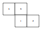
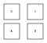
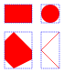

# Delta 4 - Positioning

> `svgdx` provides alternatives to the absolute positioning of elements provided by SVG

## Overview

Most SVG elements are placed on a coordinate grid using absolute values within a defined coordinate system. An exception to this is the `<tspan>` element, which naturally "follows on" in terms of position from the previous `<tspan>` element. Being able to do this (and more) would be useful for other SVG elements, and is provided by `svgdx`.

Two important notes should be considered when planning positioning in `svgdx`:

* User units should be used throughout; absolute units (e.g. those with some measurement suffix, such as `px` or `mm`) will prevent `svgdx` understanding the positions of elements.
* `svgdx` diagrams are 'expected' to be between approximately 10 and 1000 units in each dimension. While there are no hard limits on size, various aspects make assumptions about appropriate absolute values - such as default text or arrow-head size - which won't be valid with very small or very large drawings. SVG is by nature scalable, and scaling the largest dimension to fit in this range should generally be feasible.

## Simple relative positioning

The simple cases of 'after the previous element' and 'below the previous element' which `<tspan>` handles automatically for text are dealt with generically in `svgdx` through special cases of the `xy` attribute.

| `xy` attribute value | meaning |
|---|---|
| `"^:h"` | to the right of ('horizontally after') the previous element |
| `"^:H"` | to the left of ('horizontally before') the previous element |
| `"^:v"` | below ('vertically after') the previous element |
| `"^:V"` | above ('vertically before') the previous element |

For each of these, a further numeric value can be given which provides the 'margin' before the next element starts.

So we can have:



```xml
{{#include ./images/positioning-simple-1.xml}}
```

or:



```xml
{{#include ./images/positioning-simple-2.xml}}
```

## Layout

The most important concept for positioning is the element **bounding box**. This is an axis-aligned rectangle which is the minimum size required to cover a shape. For (non-rotated) `<rect>` elements, the bounding box is identical with the element's own layout; for other shapes it will there will usually be some area inside the bounding box that is not within the shape itself.

The diagram below shows the bounding box (blue dashed line) of several shapes (in red).



Each bounding box has nine 'locations' which can be used as related
