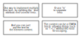

# Delta 2 - Shape Text

> Associating text with shapes is a fundamental diagramming technique

## Overview

SVG supports a number of different 'basic shapes', as well as support for complex 'path' elements comprising line and curve segments. Text elements are also supported, but are entirely independent of other elements. Since associating text with shape elements is such a common part of making diagrams, `svgdx` has various tools to make this easier.

## The `text` attribute

Consider the following (not very interesting!) image:


This is generated from the following `svgdx` document:

```xml
{{#include ./images/text-shape.xml}}
```

The value of any `text` attribute is extracted and a new `<text>` element is created placed so it appears within the shape - centered by default.

The first (rectangle) element above is converted by svgdx into the following SVG fragment - the base element is immediately followed by a new text element, with content generated from the `text` attribute and positioned appropriately.

```xml
{{#include ./images/text-shape-fragment.xml}}
```

Note the use of the `d-tbox` class; CSS is used to anchor text as required; for centered text, the anchor is set to the center of the text itself, rather than the bottom-left default.

## Multi-line text

The text attribute works well where there is a single short text value - perhaps a label - attached to another element. If the text is longer, squeezing into a single attribute could be messy. There are several ways of dealing with this:

```xml
{{#include ./images/text-multiline.xml}}
```



## Text positioning


## Text styling

## Standalone text elements
