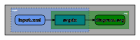
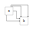
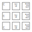
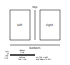
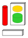

# **svgdx** examples

## svgdx



```
svgdx svgdx.xml -o svgdx.svg
```

[svgdx.svg](svgdx.svg)

[svgdx.xml](svgdx.xml)

## Functional Block Diagram

From the Wikipedia [Functional block diagram](https://en.wikipedia.org/wiki/Functional_block_diagram) page, the following diagram shows "the attitude control and maneuvering electronics system of the Gemini spacecraft".

This is the sort of diagram `svgdx` targets; boxes and lines, with layout providing some useful semantic structure.


[original source](https://commons.wikimedia.org/wiki/File:Functional_block_diagram_of_the_attitude_control_and_maneuvering_electronics_system.jpg)

An SVG reproduction of this diagram created using `svgdx` is shown below:


[source](functional_block_diagram.svg)

[input file](functional_block_diagram.xml)

## Connectors



[source](edge-connector.svg)

[input file](edge-connector.xml)

## More connectors


[source](corner-lines.svg)

[input file](corner-lines.xml)

## Text boxes


[source](rect-text.svg)

[input file](rect-text.xml)

## Multi-line text alignment



[source](multiline-text.svg)

[input file](multiline-text.xml)

## Text associated with lines



[source](line-text.svg)

[input file](line-text.xml)

## Relative positioning


[source](loc.svg)

[input file](loc.xml)

## Surrounding shapes


[source](surround.svg)

[input file](surround.xml)

## Text within shapes


[source](text-attr.svg)

[input file](text-attr.xml)

## Repeating elements


[source](repeat.svg)

[input file](repeat.xml)

## Variables and expressions


[source](define.svg)

[input file](define.xml)

## Reuse and templating



[source](reuse.svg)

[input file](reuse.xml)
