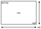
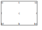

# Design Principles

1. The target is SVG 1.1, as defined by https://www.w3.org/TR/SVG11/. SVG 2 support is not intended due to (at present) poor support. Note that SVG 1.1 is the target - not any particular implementation or use case (e.g. web browsers are one target among many; HTML embedding cannot be assumed).
2. All valid SVG input must be preserved as-is; this is key to incremental improvement of both spec and implementation.
3. Limitations in scope are acceptable, even when no long-term plan seems viable to address them. For example, SMIL animation is unlikely to feature in use-cases considered by this project.
4. Where SVG has support for features, it should be used and expected to be used; the tool should not provide alternatives which provide minimal benefit over existing SVG support. For example centered text should be supported via appropriate `dominant-baseline` and `text-anchor` presentation attributes, rather than adjusted placement of text.
5. A "support library" should be developed, including symbols, CSS, and definitions (e.g. for arrow-head markers). Where reasonable, reference to library entities should be preferred to additional code in the tool.

# Target Feature List
* Given a basic `<svg>` element, derive reasonable attributes in the output including automatic `viewport`, derived from the bounding box of the contained elements.
* Ability to "watch" files and re-compile them on change, including at directory level.
* Relative positioning of 'sized' elements, including ability to 'distribute' elements linearly over a range.
* 'Hidden' elements, used for geometry reference, but not part of the output.
* "Geometric" scaling of symbols / groups.
* Attribute broadcast
* Automatic insertion of relevant blocks from library files.
* Inclusion by reference or inline of styles and other library entities.

# Concepts
* Bounding boxes for 'sized' elements (initially SVG's "Basic Shapes").
* Locations
* Uniform placement, eg xy, cxy, wh, etc
* Relative positioning - including percentage along a bounding box line
* Element aware attribute broadcasting
* ‘Standard library’
* Extensibility
* Ubiquitous text - every element can have attached text with context-dependent placement

# Geometry & Placement

## SVG Basic Shape Geometry

See https://www.w3.org/TR/SVG11/shapes.html

There are just six 'Basic Shapes' in SVG:

* rect
* circle
* ellipse
* line
* polyline
* polygon

The first four of these have trivial bounding boxes, and for the last two these can easily be computed by the maximum extent of any component.
With bounds for each of these basic shapes established, a common scheme can be imposed across these despite their different syntax in SVG.

> In the following discussion, transforms (e.g. rotation and scaling) are not considered.

Given an axis-aligned rectangular bounding box, a shape's position can be determined by a combination of the following:

* `xy` & `wh` (top-left, width & height)
* `xy1` & `wh` (top-left, width & height; equivalent to `xy` & `wh`)
* `xy2` & `wh` (bottom-right, width & height)
* `cxy` & `wh` (center, width & height)
* `xy1` & `xy2` (top-left, bottom-right)

The corners of a bounding box are as follows:

|||
|-|-|
| `xy` | determines the top-left position of the bounding box |
| `cxy` | determines the center of the bounding box |
| `wh` | determines the width/height of the bounding box |
| `xy1` | determines the top-left position of the bounding box |
| `xy2` | determines the bottom-right position of the bounding box |

See the following diagram:

The corresponding *locations* (for relative positioning) are given by the following diagram.

## Attribute expansion

Many attributes which are pairs in SVG may be combined for more concise specification.

| Attribute | Maps to              |
|-----------|----------------------|
| `xy`      | `x` and `y`          |
| `rxy`     | `rx` and `ry`        |
| `wh`      | `width` and `height` |
| `cxy`     | `cx` and `cy`        |
| `xy1`     | `x1` and `y1`        |
| `xy2`     | `x2` and `y2`        |

> **Notes**
> * If a single value is given for any of these 'pair' attributes, it is used for both of the resulting values.
> * `rxy` is only valid for ellipses
> * For `circle`, `wh` maps to 2*`r`; for `ellipse` maps to 2*`rx` & 2*`ry`
